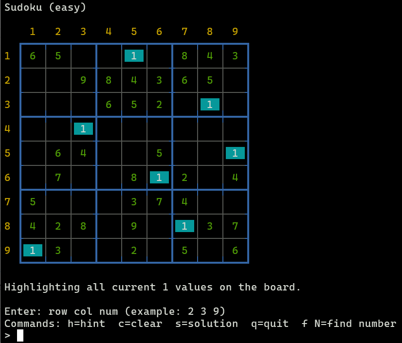

# sudoku
 
      

This version of Sudoku is created from a **simple bash shell script** for Linux, with a little support from ChatGPT. 

Nothing to install:
```
$ ./sudoku [easy| medium | hard | expert]
```

<br>

| ***Command*** | ***Description*** |
|----------|-----------|
| Row Column Number | Select the cell and number |
| h | Hint |
| f # | Find all # |
| s | Solution |
| c | Clear board |
| q | Quit

<br>


